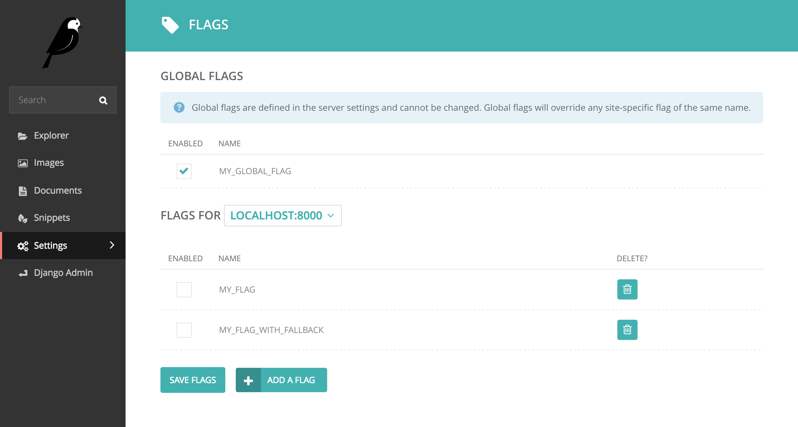

# Wagtail-Flags

[](https://travis-ci.org/cfpb/wagtail-flags)
[](https://coveralls.io/github/cfpb/wagtail-flags?branch=master)

Feature flags allow you to toggle functionality without multiple deployments. Wagtail-Flags lets you use feature flags that are set in the Wagtail admin.




## Dependencies

- Django 1.8+
- Wagtail 1.7+
- Python 2.7+, 3.5+


## Installation

1. Install wagtail-flags using pip:

   ```shell
pip install wagtail-flags
```

2. Add `flags` as an installed app in your Django `settings.py`:

   ```python
 INSTALLED_APPS = (
     ...
     'flags',
     ...
 )
```

## Usage

- [Defining flags](#defining-flags)
  - [Site-specific flags](#site-specific-flags)
  - [Global flags](#global-flags)
- [Using flags](#using-flags)
  - [In Python](#in-python)
  - [In Django views](#in-django-views)
  - [In `urls.py`](#in-urlspy)
  - [In Django templates](#in-django-templates)
  - [In Jinja2 templates](#in-jinja2-templates)


There are two kinds of feature flags in Wagtail-Flags.

1. Flags that are specific to a [Wagtail `Site`](http://docs.wagtail.io/en/stable/reference/pages/model_reference.html#site), stored in the database, and enabled or disabled in the Wagtail or Django admin.
2. Global flags that are specified in Django settings, not specific to a [Wagtail `Site`](http://docs.wagtail.io/en/stable/reference/pages/model_reference.html#site) and only enabled or disabled by changing the Django settings.

Global flags will override any Wagtail `Site`-specific flag and will not be editable in the admin.

### Defining flags

#### Site-specific flags

To define Wagtail `Site`-specific feature flags, go to "Settings", then "Flags" in the Wagtail admin.


From here you can click on the "Add a flag" button to add a feature flag or select a Wagtail `Site` from the "Flags for" dropdown list and then enable or disable flags by clicking the checkboxes.


#### Global flags

To define global feature flags in Django settings add a `FLAGS` dictionary to your `settings.py` file:

```python
FLAGS = {
    'MY_FLAG': True,
}
```

This will override all `Site`-specific flags by the same name whether `True` or `False`.

### Using flags

The Wagtail-Flags app provides three basic functions to check the state of feature flags.

- `flag_enabled` will return True if the feature flag is enabled in Django settings or for the Wagtail `Site`.

- `flag_disabled` will return True if the feature flag is disabled in Django settings or for the Wagtail `Site`, or does not exist at all.

#### In Python

In Python these functions can be imported from `flags.state`. Both take the flag name and an optional second argument that is either a Wagtail `Site` object or an `HttpRequest` from which a Wagtail `Site` will be looked-up. If no request or site is given, only global flag state will be checked.

```python
from flags.state import (
    flag_enabled,
    flag_disabled,
)

if flag_enabled('MY_FLAG', request):
	print("My feature flag is enabled")

if flag_disabled('MY_FLAG', request):
	print(“My feature flag is disabled”)
```

#### In Django Views

A `@flag_required` decorator is provided to require a particular flag for a Django view. The default behavior is to return a 404 if the flag is not set, but an optional fallback view function can be specified instead.

```python
from flags.decorators import flag_required

@flag_required('MY_FLAG')
def view_requiring_flag(request):
    return HttpResponse('flag was set')

def other_view(request):
    return HttpResponse('flag was not set')

@flag_required('MY_FLAG_WITH_FALLBACK', fallback_view=other_view)
def view_with_fallback(request):
    return HttpResponse('flag was set')
```

For more complex use cases a `@flag_check` decorator is provided that can be used to check for a particular value of a flag, with an optional fallback.

```python
from flags.decorators import flag_check

@flag_check('MY_FLAG', True)
def view_requiring_flag(request):
    return HttpResponse('flag was set')

@flag_check('MY_OTHER_FLAG', False)
def view_when_flag_is_not_set(request):
    return HttpResponse('flag was set')

def other_view(request):
    return HttpResponse('flag was not set')

@flag_required('MY_FLAG_WITH_FALLBACK', True, fallback=other_view)
def view_with_fallback(request):
    return HttpResponse('flag was set')
```

**Note**, because flags that do not exist are taken to be `False` by default, `@flag_check('MY_FLAG', False)` and `@flag_check('MY_FLAG', None)` will both succeed if `MY_FLAG` does not exist.

#### In `urls.py`

For URL handling, there is `flagged_url()` which can be used in place of Django's `url()`. **Note**, it will not work for `include()` url.

```python
from flags.urls import flagged_url

urlpatterns = [
    flagged_url('MY_FLAG', r'^an-url$', view_requiring_flag, condition=True),
    flagged_url('MY_FLAG_WITH_FALLBACK', r'^another-url$', view_with_fallback,
                condition=True, fallback=other_view)
]

```

#### In Django templates

In Django templates you'll need to load the `feature_flags` template tag library. You can then use `flag_enabled`, `flag_disabled`, and `flags_enabled` tags:

```django



  <div class="m-global-banner">
    I’m a the result of a feature flag.   
  </div>

```


#### In Jinja2 templates

The `flag_enabled` and `flag_disabled` functions can also be added to a Jinja2 environment and subsequently used in templates. Both require a request or Wagtail `Site` as the second argument.

```python
from flags.template_functions import (
    flag_enabled,
    flag_disabled
)

...

env.globals.update(
    flag_enabled=flag_enabled,
    flag_disabled=flag_disabled
)
```

```jinja

  <div class="m-global-banner">
    I’m a the result of a feature flag.   
  </div>

```


## Getting help

Please add issues to the [issue tracker](https://github.com/cfpb/wagtail-flags/issues).

## Getting involved

General instructions on _how_ to contribute can be found in [CONTRIBUTING](CONTRIBUTING.md).


----

## Open source licensing info
1. [TERMS](TERMS.md)
2. [LICENSE](LICENSE)
3. [CFPB Source Code Policy](https://github.com/cfpb/source-code-policy/)


----

## Credits and references

1. Forked from [cfgov-refresh](https://github.com/cfpb/cfgov-refresh/tree/master/cfgov/flags)
