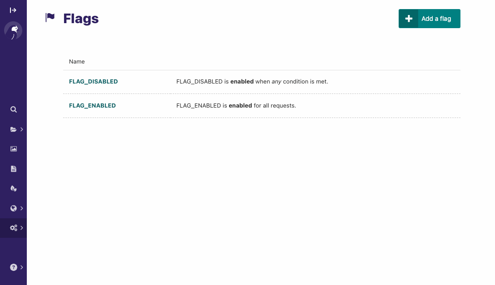
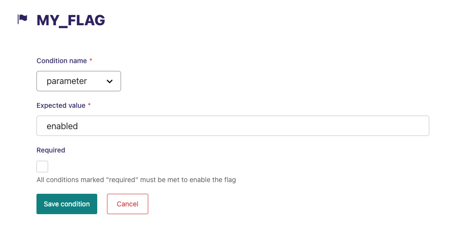

# Wagtail-Flags

[](https://github.com/cfpb/wagtail-flags/actions?query=workflow%3Atest)
[](https://ethicalsource.dev/definition/)

Feature flags allow you to toggle functionality based on configurable conditions.

Wagtail-Flags adds a Wagtail admin UI and Wagtail Site-based condition on top of [Django-Flags](https://github.com/cfpb/django-flags). For a more complete overview of feature flags and how to use them, please see the [Django-Flags documentation](https://cfpb.github.io/django-flags).



- [Dependencies](#dependencies)
- [Installation](#installation)
- [Usage](#usage)
- [Extended conditions](#extended-conditions)
- [Signals](#signals)
- [Getting help](#getting-help)
- [Getting involved](#getting-involved)
- [Licensing](#licensing)
- [Credits and references](#credits-and-references)

## Dependencies

- Python 3.8+
- Django 4.2 (LTS)+
- Django-Flags 5.0
- Wagtail 6.0+

It should be compatible at all intermediate versions, as well.
If you find that it is not, please [file an issue](https://github.com/cfpb/wagtail-flags/issues/new).

## Installation

1. Install Django-Flags and Wagtail-Flags:

```shell
pip install django-flags
pip install wagtail-flags
```

2. Add `flags` and `wagtailflags` as installed apps in your Django `settings.py`:

 ```python
 INSTALLED_APPS = (
     ...
     'flags',
     'wagtailflags',
     ...
 )
```

## Usage

Please see the [Django-Flags documentation](https://cfpb.github.io/django-flags) for the most current information about defining and checking feature flags.

First, define the flag in Django `settings.py`:

```python
FLAGS = {
    'MY_FLAG': []
}
```

Then use the flag in a Django template (`mytemplate.html`):

```django




  <div class="flagged-banner">
    I’m the result of a feature flag.
  </div>

```

Next, configure a URL for that template (`urls.py`):

```python
from django.urls import path
from django.views.generic import TemplateView

urlpatterns = [
    path(r'mypage/', TemplateView.as_view(template_name='mytemplate.html')),
]
```

Finally, add conditions for the flag in the Wagtail admin under "Settings", "Flags", "MY_FLAG":



## Extended conditions

Wagtail-Flags adds the following conditions to Django-Flags:

##### `site`

Allows a flag to be enabled for a Wagtail site that matches the hostname and port in the condition value.

```python
FLAGS = {
    'MY_FLAG': [
        {'condition': 'site', 'value': 'staging.mysite.com'}
    ],
}
```

## Signals

Wagtail-Flags includes  `flag_enabled` and `flag_disabled` signals that can be received when the "Enable for all requests" and "Disable for all requests" buttons are pressed in the admin. This is intended to enable things like front-end cache invalidation.

```python
from django.dispatch import receiver

from wagtail.contrib.frontend_cache.utils import purge_url_from_cache

from wagtailflags.signals import flag_disabled, flag_enabled


@receiver(flag_enabled)
def purge_on_flag_enabled(sender, **kwargs):
    flag_name = kwargs["flag_name"]
    purge_url_from_cache(...)

@receiver(flag_disabled)
def purge_on_flag_disabled(sender, **kwargs):
    flag_name = kwargs["flag_name"]
    purge_url_from_cache(...)
```

**Please note:** These signals are only sent for manual presses of the "Enable for all requests" and "Disable for all requests" buttons in the admin. Other flag conditions may vary within and only be valid for a specific request cycle.

## Getting help

Please add issues to the [issue tracker](https://github.com/cfpb/wagtail-flags/issues).

## Getting involved

General instructions on _how_ to contribute can be found in [CONTRIBUTING](CONTRIBUTING.md).

## Licensing
1. [TERMS](TERMS.md)
2. [LICENSE](LICENSE)
3. [CFPB Source Code Policy](https://github.com/cfpb/source-code-policy/)

## Credits and references

1. Forked from [cfgov-refresh](https://github.com/cfpb/cfgov-refresh)
